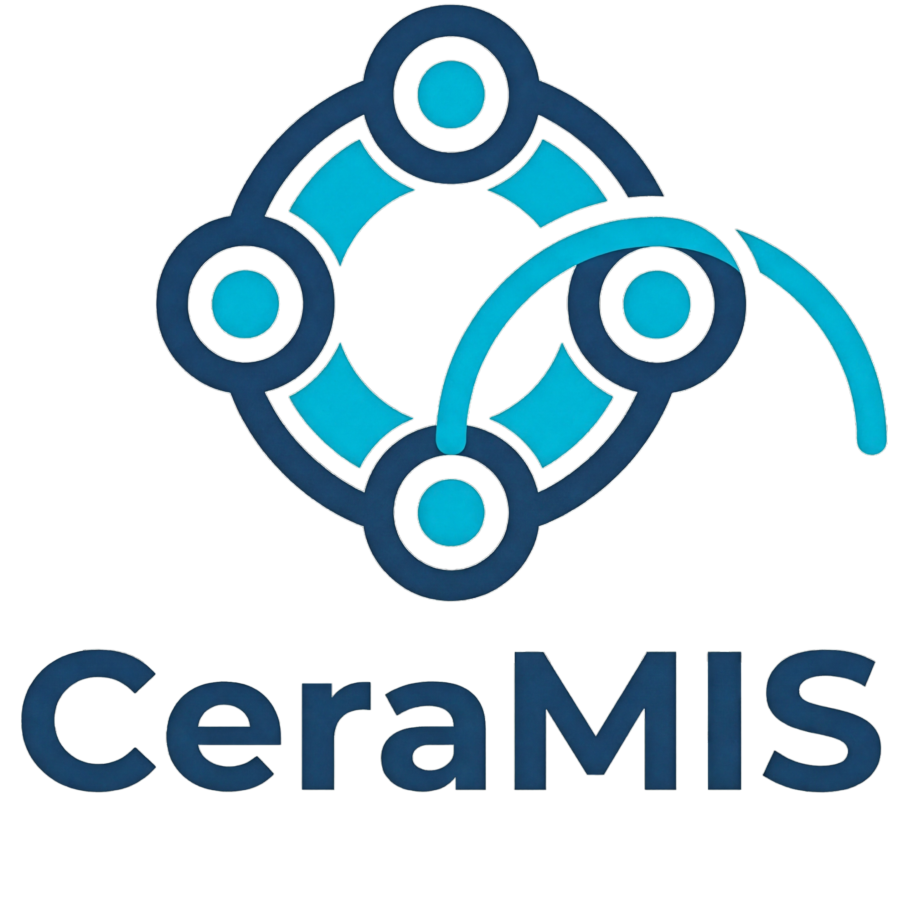
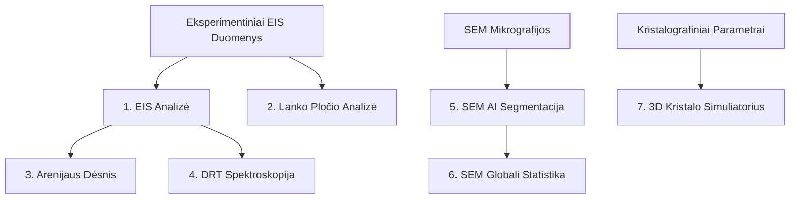

<div align="center">

    
### Ceramic Microstructure & Impedance System
#### **Keramikos Mikrostruktūros ir Impedanso Sistema**
</div>

[](https://www.python.org/)
[](https://docs.python.org/3/library/tkinter.html)
[-red.svg)](https://github.com/facebookresearch/segment-anything-2)
[](https://docs.pyvista.org/)
[](LICENSE)

---

> [!NOTE]
> **English speakers:** For the English version of the documentation, please see **[README_ENG.md](README_ENG.md)**.

**CeraMIS** – tai programinė įranga, skirta Ličio Lantano Titanato (**LLTO**) kietųjų elektrolitų kompleksinei impedanso spektroskopijos (EIS), relaksacijos trukmės pasiskirstymo (DRT), struktūrinės 3D perovskitų simuliacijos ir SEM mikrostruktūros dirbtinio intelekto analizei.

Programa apjungia mašininio mokymosi algoritmus (Meta SAM 2.1 / 3.1) su klasikiniais elektrocheminiais ir kristalografiniais modeliais. Visa sistema (įskaitant išorinius modulius ir 3D vizualizatorius) yra pilnai pritaikyta lietuvių ir anglų kalboms.

---

## 🗺️ Sistemos Moduliai ir Funkcionalumas

Programa yra padalinta į **8 specializuotus modulius (korteles)**, apimančius visą kietojo kūno elektrolitų tyrimo eigą:



### 1. 📈 EIS Analizė (Elektrocheminė Impedanso Spektroskopija)

*   **3x3 Grafinė Matrica**: Vienu metu atvaizduojami 9 skirtingi fizikiniai grafikai pasirinktinai iš **17 galimų tipų** (Nyquist, Bode, dielektrinė skvarba, laidumas, modulis, Summerfield, Cole-Cole ir kt.).
*   **Geometrinis Normalizavimas**: Automatinis matavimų perskaičiavimas į specifinius vienetus įvertinant bandinio geometriją – storį ($L$) ir plotą ($A$).
*   **Palaikomi Formatai**: Tiesioginis eksperimentinių `.txt`, ZView `.z` bei kelių lapų Excel `.xlsx` failų importas.

> [!TIP]
> Detalų EIS modulių (taip pat ir grafiko redagavimo bei eksporto funkcijų) aprašymą rasite dokumente: **[README_EIS_PLOTS.md](README_EIS_PLOTS.md)**.

---

### 2. 🌀 Lanko Pločio Analizė

*   Interaktyvus impedanso puslankių pločio ir jų charakteringųjų dažnių identifikavimas Cole-Cole erdvėje.
*   Vizualus skirtingų laidumo mechanizmų (tūrinio, grūdelių ribų ir poliarizacijos) atskyrimas.

> [!TIP]
> Detalų lanko analizės modulio aprašymą rasite dokumente: **[README_ARC_WIDTH.md](README_ARC_WIDTH.md)**.

---

### 3. 🌡️ Arenijaus Analizė

*   **Aktyvacijos Energijos ($E_{a}$) Skaičiavimas**: Automatinis tiesinis parametrų derinimas naudojant $\sigma T = \sigma_{0} \exp\left(-\frac{E_{a}}{k_{B} T}\right)$ sąryšį.
*   **Komponentų Išskyrimas**: Atskiras tūrinio laidumo (Bulk), grūdelių ribų (Grain Boundary) bei pilno laidumo (Total) aktyvacijos energijų (eV) skaičiavimas.
*   **Išmanus Redagavimas**: Interaktyvus taškų įtraukimas / pašalinimas iš regresijos, momentinis $R^2$ ir $E_{a}$ perskaičiavimas bei kelių regresijų overlay grafike.

> [!TIP]
> Detalų Arenijaus modulio aprašymą rasite dokumente: **[README_ARRHENIUS.md](README_ARRHENIUS.md)**.

---

### 4. ⚡ DRT Analizė (Relaxation Time Distribution)

*   **Aukštos raiškos analizė**: Persidengiančių impedanso puslankių atskyrimas ir analizė laiko (dažnių) skalėje.
*   **Pikų integravimas**: Poliarizacijos varžos ($R$) ir efektyviosios talpos ($C$) skaičiavimas naudojant skaitinę Simpsono integraciją.
*   **Automatinė paieška**: Automatinis viršūnių bei valley rėžių nustatymas ir integravimas.

> [!TIP]
> Detalų DRT modulio aprašymą rasite dokumente: **[README_DRT.md](README_DRT.md)**.

---

### 5. 🤖 SEM Analizė (AI / SAM 2.1 & 3.1)

*   **Segment Anything Model (SAM)**: Automatinis kietojo elektrolito grūdelių (grains) aptikimas ir kontūrų segmentavimas SEM mikrografijose su Meta SAM 2.1 arba SAM 3.1.
*   **3D Reljefo Rekonstrukcija**: Pilna 3D paviršiaus topografijos vizualizacija naudojant PyVista (VTK pagrindu). Gylis ($z$) rekonstruojamas pagal pilkumo skalės intensyvumą.
*   **Skilimo Analizė**: Kiekybinis lūžio topologijos įvertinimas (Intergranuliarinis vs Transgranuliarinis skilimas) skaičiuojant gylio skirtumus grūdelių viduje ir jų sandūrose.
*   **Šiurkštumo Parametrai**: Kiekvieno grūdelio bei globalaus paviršiaus Ra ir Rq šiurkštumo charakteristikų skaičiavimas.

> [!TIP]
> Detalų dirbtinio intelekto modelio aprašymą rasite dokumente: **[README_SAM.md](README_SAM.md)**.

---

### 6. 📊 SEM Globali Statistika

*   **Multi-failų Apjungimas**: Apjungia iki 10 Excel failų grūdelių morfologijos matavimus.
*   **Morfologinė Analizė**: Ekvivalentinio diametro, ploto, sferiškumo, anizotropijos, perimetro, 3D ploto bei šiurkštumo pasiskirstymo kreivės.
*   **Bimodalė histograma + KDE**: Automatinė unimodalių / bimodalių pasiskirstymo pikų analizė.

> [!TIP]
> Detalų SEM statistikos modulio aprašymą rasite dokumente: **[README_SEM_STATS.md](README_SEM_STATS.md)**.

---

### 7. 💎 3D Kristalo Simuliatorius

*   **LLTO Perovskito Struktūra**: Li<sub>3x</sub>La<sub>2/3-x</sub>TiO<sub>3</sub> perovskito gardelės vizualizacija su koordinaciniais oktaedrais.
*   **Ličio Jonų Transporto Simuliacija**: Elektrinio lauko valdomas realaus laiko Li<sup>+</sup> jonų šokinėjimas tarp vakansijų su periodinėmis ribinėmis sąlygomis.
*   **Grūdelių Ribos ir Langai**: Dviejų skirtingai orientuotų kristalinių sričių sujungimas (dvyniai) bei deguonies langų (O<sub>4</sub> transporto kanalų) vizualizavimas.

> [!TIP]
> Detalų kristalo simuliatoriaus modulio aprašymą rasite dokumente: **[README_CRYSTAL.md](README_CRYSTAL.md)**.

---

### 8. 📉 Savo Grafiko Kūrimas ir 3D Analizė

*   **Laisvas ašių pasirinkimas**: Galima rinktis bet kurią iš **17 fizikinių kiekybių** X, Y ir Z (3D) ašims:

| Kiekybė | Žymėjimas | Vienetai |
|---|---|---|
| Dažnis | $f$ | Hz |
| Realiosios impedanso dalis | $Z'$ | Ω·m |
| Menamoji impedanso dalis | $-Z''$ | Ω·m |
| Impedanso modulis | $\|Z\|$ | Ω·m |
| Reali dielektrinė skvarba | $\varepsilon'$ | vnt. |
| Dielektriniai nuostoliai | $\varepsilon''$ | vnt. |
| **Savitasis realusis laidumas** | $\sigma'$ | S/m |
| **Savitoji talpa (savo talpa)** | $\sigma''$ | S/m |
| Elektrinis modulis | $M''$ | vnt. |
| Fazės kampas | $-\Theta$ | ° |
| Nuostolių tangentas | $\tan\delta$ | — |
| Normalizuota Z'' | $Z''/Z''_{max}$ | — |
| Normalizuota M'' | $M''/M''_{max}$ | — |
| Pseudo-DRT | $-dZ'/d(\log f)$ | — |
| Temperatūra | $T$ | K |
| Inversine temperatūra | $1000/T$ | K⁻¹ |

> [!NOTE]
> **σ'' (menamoji laidumas / savo talpa)** skaičiuojama kaip:
> $$\sigma'' = -\frac{Z_n''}{|Z_n|^2} \quad \text{(S/m)}$$
> σ' prieš σ'' grafikas (Nyquist tipo laidumo erdvėje) leidžia tiesiogiai įvertinti talpinę ir rezistyvinę sudedamąsias atskirai.

*   **3D Išplėstinė Analizė** (10 grafikų viename lange):
    1. 3D Nyquist-Bode spiralė
    2. Nyquist evoliucija priklausomai nuo T
    3. Cole-Cole 3D
    4. Fazės kampo 3D
    5. Laidumo paviršius (log σ' vs log f vs T)
    6. Elektrinio modulio paviršius (M'' vs f vs T)
    7. Pseudo-DRT reljefas
    8. Laidumo žemėlapis (1000/T ašimi)
    9. Normalizuotas Z'' paviršius
    10. Normalizuotas M'' paviršius

> [!TIP]
> Visų 3D ir 2D grafikų spalvų paletę galima keisti **dukart spustelėjus dešiniuoju mygtuku** ant grafiko.

---

### 9. ⚙️ Nustatymai (Settings)

*   **Kalbos Pasirinkimas**: Vartotojo sąsajos kalbos pasirinkimas (`en` / `lt`).
*   **Programos Mastelis**: Lanksus mastelio koeficientas (`0.75x` iki `2.0x`).
*   **SEM AI Modelio Pasirinkimas**: SAM 2.1 arba SAM 3.1.
*   **Numatytieji Keliai**: Automatinis failų užkrovimas paleidžiant programą.

---

## 🛠️ Reikalavimai ir Įdiegimas

Programai paleisti reikalinga **Python 3.11+** versija ir CUDA palaikymas vaizdo plokštėje (rekomenduojama greitam AI kaukės generavimui).

### 1. Virtualios aplinkos paruošimas
```powershell
cd CeraMIS
python -m venv .venv
.venv\Scripts\activate
```

### 2. Priklausomybių įdiegimas
```powershell
pip install numpy scipy pandas matplotlib seaborn pyvista pyvistaqt openpyxl lmfit torch torchvision opencv-python PyQt6
```

### 3. Dirbtinio intelekto svorių (Weights) įkėlimas
Norint naudoti SEM AI segmentaciją, į projekto šakninį katalogą būtina įkelti modelio svorius:
*   SAM 3.1 Multiplex modelis: `sam3.1_multiplex.pt`
*   SAM 2.1 Hiera modelis: `sam2.1_hiera_large.pt` (jei naudojama SAM 2 versija)

---

## 🚀 Programos Paleidimas

```powershell
python "main CeraMIS.py"
```

> [!NOTE]
> Paleidus programą, ji automatiškai patikrins šalia esantį `results/` aplanką ir iš jo įkels pirmuosius rastus eksperimentinius duomenis (pvz., `.xlsx`, `.z`, `.json` failus ir SEM nuotraukas). Jūs galite patalpinti ten savo demo rezultatus, kad kiti vartotojai galėtų iškart išbandyti programą. Jei failų šiame aplanke nėra arba norite atidaryti kitus, juos visada galite įkelti rankiniu būdu per grafinę sąsają.

---

## ⚖️ Licencija ir Autorinės Teisės

*   **Programinės įrangos autorius**: Mantas Jonas Marcinkevičius
*   **Licencija**: Licensed under the Apache License, Version 2.0 (see [LICENSE](LICENSE)).
