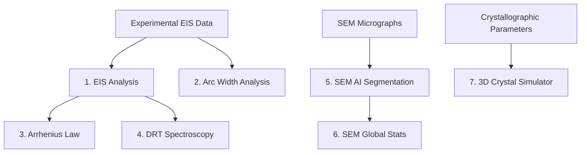

<div align="center">

    
### Ceramic Microstructure & Impedance System
#### **Ceramic Microstructure and Impedance System**
</div>

[](https://www.python.org/)
[](https://docs.python.org/3/library/tkinter.html)
[-red.svg)](https://github.com/facebookresearch/segment-anything-2)
[](https://docs.pyvista.org/)
[](LICENSE)

---

# English Documentation

> [!NOTE]
> For the Lithuanian version of the documentation, please see [README.md](README.md).

**CeraMIS** (Ceramic Microstructure and Impedance System) is a comprehensive software package designed for the analysis of Lithium Lanthanum Titanate (**LLTO**) solid-state electrolytes. It integrates Electrochemical Impedance Spectroscopy (EIS), Distribution of Relaxation Times (DRT), structural 3D perovskite simulation, and AI-driven SEM micrographic analysis.

The program seamlessly combines machine learning models (Meta SAM 2.1 / 3.1) with classical electrochemical and crystallographic physics equations. The entire application, including subprocesses and 3D visualizers, fully supports bilingual operation in English and Lithuanian.

---

## 🗺️ System Modules & Features

The workspace is organized into **8 specialized modules (tabs)** covering the entire workflow of solid electrolyte research:



### 1. 📈 EIS Analysis (Electrochemical Impedance Spectroscopy)
*   **3x3 Plot Matrix**: Displays 9 distinct physical plots simultaneously, customizable from **17 available types** (Nyquist, Bode, permittivity, conductivity, electrical modulus, Summerfield scaling, Cole-Cole, etc.).
*   **Geometric Normalization**: Automatic conversion of raw values to normalized ones based on specimen thickness ($L$) and area ($A$).
*   **Supported Formats**: Direct import of experimental `.txt` files, ZView `.z` files, and multi-sheet Excel `.xlsx` files.

#### 🖊️ Plot Editing and Export Dialog Features

Double-clicking the **right mouse button** on any plot (2D or 3D) opens a comprehensive editing dialog with the following features:

| Feature | Description |
|---|---|
| Plot & Axes Titles | Free-text editing for labels |
| X/Y Limits | Precise axis range constraints |
| Scale | Logarithmic / Linear selection per axis |
| Invert Axes | X, Y (and Z for 3D) |
| Legend | Toggle on / off |
| **Thermal Color Palettes** | Recolor curves by temperature: Original / Ironbow / Rainbow (Turbo) / Arctic / Custom (2 colors) |
| **Colorbar** | Temperature color scale beside the plot |
| **Apply to All Subplots** | Applies the palette to the entire 3x3 matrix instantly |
| Export Size | Width and height in inches (dpi=300) |
| **Export** | Save as PNG / PDF / SVG / EPS |
| **Copy** | Copies the plot directly to the Windows clipboard |

> [!TIP]
> A detailed guide for the EIS module is available in: **[README_EIS_PLOTS.md](README_EIS_PLOTS.md)**.

### 2. 🌀 Arc Width Analysis
*   Interactive manual detection of impedance semi-arcs and their characteristic frequencies in the Cole-Cole space.
*   Visual separation of distinct conductivity mechanisms (bulk, grain boundaries, and electrode polarization).

> [!TIP]
> A detailed guide for the Arc Width module is available in: **[README_ARC_WIDTH.md](README_ARC_WIDTH.md)**.

### 3. 🌡️ Arrhenius Analysis
*   **Activation Energy ($E_{a}$) Calculation**: Automated linear fitting using the relationship: $\sigma T = \sigma_{0} \exp\left(-\frac{E_{a}}{k_{B} T}\right)$.
*   **Path-specific Separation**: Independent calculation of bulk, grain boundary, and total activation energies (in eV).
*   **Interactive Editing**: Real-time exclusion/inclusion of points with immediate update of $R^2$ and $E_{a}$, supporting multiple regression overlays.

> [!TIP]
> A detailed guide for the Arrhenius module is available in: **[README_ARRHENIUS.md](README_ARRHENIUS.md)**.

### 4. ⚡ DRT Analysis (Distribution of Relaxation Times)
*   **High-Resolution Resolution**: Deconvolution of overlapping impedance processes in the time/frequency domain.
*   **Peak Integration**: Computation of polarization resistance ($R$) and capacitance ($C$) using numerical Simpson's integration.
*   **Automatic Peak Search**: Automatic detection of peaks and valley boundaries for targeted integration.

> [!TIP]
> A detailed guide for the DRT module is available in: **[README_DRT.md](README_DRT.md)**.

### 5. 🤖 SEM Analysis (AI / SAM 2.1 & 3.1)
*   **Segment Anything Model**: Automatic grain detection and contour segmentation in SEM images using Meta's SAM 2.1 or SAM 3.1.
*   **3D Relief Reconstruction**: Premium 3D surface topography visualization using PyVista (VTK-based), reconstructing height ($z$) based on grayscale intensity.
*   **Fracture Analysis**: Quantitative fracture topology assessment (intergranular vs. transgranular fracture) based on grain interior and boundary heights.
*   **Roughness Metrics**: Calculation of individual grain and global surface roughness (Ra and Rq).

> [!TIP]
> A detailed guide for the SAM AI module is available in: **[README_SAM.md](README_SAM.md)**.

### 6. 📊 SEM Global Statistics
*   **Multi-File Aggregation**: Merges grain morphology measurements from up to 10 exported Excel files.
*   **Morphological Analysis**: Plot distributions for equivalent diameter, area, sphericity, anisotropy, perimeter, 3D surface area, and roughness.
*   **Bimodal Histograms & KDE**: Automated peak detection and bimodal fitting using Kernel Density Estimation.

> [!TIP]
> A detailed guide for the SEM Stats module is available in: **[README_SEM_STATS.md](README_SEM_STATS.md)**.

### 7. 💎 3D Crystal Simulator
*   **LLTO Perovskite Structure**: Premium visualizer of the Li<sub>3x</sub>La<sub>2/3-x</sub>TiO<sub>3</sub> lattice with TiO<sub>6</sub> coordination octahedra.
*   **Lithium Transport Simulation**: Dynamic, real-time simulation of Li<sup>+</sup> ion hopping under an applied electric field with periodic boundary conditions.
*   **Grain Boundaries & Windows**: Twin crystal boundary visualization and oxygen transport channels (O<sub>4</sub> windows).

> [!TIP]
> A detailed guide for the crystal visualizer is available in: **[README_CRYSTAL.md](README_CRYSTAL.md)**.

### 8. 📉 Custom Plot Creation & 3D Analysis

*   **Free axis selection**: You can choose any of the **17 physical quantities** for the X, Y, and Z (3D) axes:

| Quantity | Symbol | Units |
|---|---|---|
| Frequency | $f$ | Hz |
| Real Impedance | $Z'$ | Ω·m |
| Imaginary Impedance | $-Z''$ | Ω·m |
| Impedance Modulus | $\|Z\|$ | Ω·m |
| Real Permittivity | $\varepsilon'$ | a.u. |
| Dielectric Loss | $\varepsilon''$ | a.u. |
| **Real Conductivity** | $\sigma'$ | S/m |
| **Imaginary Conductivity (Self-Capacitance)** | $\sigma''$ | S/m |
| Electrical Modulus | $M''$ | a.u. |
| Phase Angle | $-\Theta$ | ° |
| Loss Tangent | $\tan\delta$ | — |
| Normalized Z'' | $Z''/Z''_{max}$ | — |
| Normalized M'' | $M''/M''_{max}$ | — |
| Pseudo-DRT | $-dZ'/d(\log f)$ | — |
| Temperature | $T$ | K |
| Inverse Temperature | $1000/T$ | K⁻¹ |

> [!NOTE]
> **σ'' (Imaginary Conductivity / Self-Capacitance)** is calculated as:
> $$\sigma'' = -\frac{Z_n''}{|Z_n|^2} \quad \text{(S/m)}$$
> A plot of σ' vs σ'' (Nyquist-type in conductivity space) allows direct separation of resistive and capacitive components.

*   **3D Advanced Analysis** (10 plots in one window):
    1. 3D Nyquist-Bode Spiral
    2. Nyquist Evolution by T
    3. Cole-Cole 3D
    4. Phase Angle 3D
    5. AC Conductivity Surface (log σ' vs log f vs T)
    6. Electrical Modulus Surface (M'' vs f vs T)
    7. Pseudo-DRT Relief
    8. Conductivity Map (1000/T axis)
    9. Normalized Z'' Surface
    10. Normalized M'' Surface

> [!TIP]
> The color palette for all 3D and 2D custom plots can be changed by **double right-clicking** on the plot area.

### 9. ⚙️ Settings
*   **Language Selection**: Toggle between English (`en`) and Lithuanian (`lt`). Standalone subprocesses, Matplotlib canvases, QTableWidgets, and PyVista widgets instantly honor the chosen locale.
*   **GUI Scale**: Adjustable window scaling factor from `0.75x` to `2.0x` for high-DPI (4K) monitors.
*   **SAM Model Selection**: Toggle between **SAM 2.1** and **SAM 3.1** directly within the graphical settings tab.
*   **Default Path Configuration**: Simplifies work by preloading specific files and setting the initial directory of file dialogs for:
    *   **Default EIS spectrum file** (`default_spectrum_file`).
    *   **Default dearEIS project file** (`default_deareis_project`).
    *   **Default SEM photos folder** (`default_sem_folder`).
    *   **Default SEM stats folder** (`default_sem_stats_folder`).

---

## 🛠️ Requirements & Installation

CeraMIS requires **Python 3.11+** and an optional NVIDIA CUDA-capable GPU for faster AI mask generation.

### 1. Virtual Environment Setup
```powershell
# Clone or copy the project into a directory
cd CeraMIS

# Create virtual environment
python -m venv .venv

# Activate virtual environment (Windows)
.venv\Scripts\activate
```

### 2. Dependencies
Install all required libraries:
```powershell
pip install numpy scipy pandas matplotlib seaborn pyvista pyvistaqt openpyxl lmfit torch torchvision opencv-python PyQt6
```

### 3. Model Weights
To enable SEM AI segmentation, place the model weights in the project's root folder:
*   SAM 3.1 Multiplex: `sam3.1_multiplex.pt` (main root directory)
*   SAM 2.1 Hiera: `sam2.1_hiera_large.pt` (if using SAM 2.1)

---

## 🚀 Running the Application

With your virtual environment active, run the main file:

```powershell
python "main CeraMIS.py"
```

> [!NOTE]
> Upon startup, CeraMIS checks the configured settings for default spectrum and dearEIS project paths. If they exist, it will auto-load them. Otherwise, you can easily load your data manually using the **"📂 Select File..."** or **"📂 Load dearEIS Project..."** buttons.

---

## ⚖️ License

*   **Author**: Mantas Jonas Marcinkevičius
*   **License**: Licensed under the Apache License, Version 2.0 (see [LICENSE](LICENSE)).
