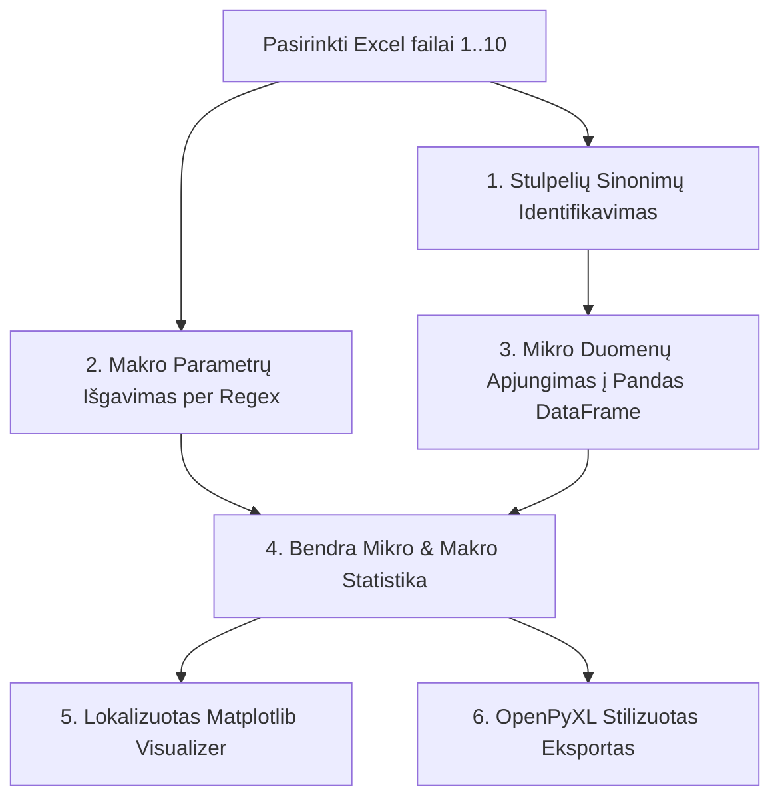

# 📊 SEM Globali Statistika
### Excel Duomenų Apjungimo ir Bendrosios Analizės Posistemė (`sem_stats_module.py`)

[](https://www.python.org/)
[](https://pandas.pydata.org/)
[-orange.svg)](https://scipy.org/)
[](https://openpyxl.readthedocs.io/)

---

**`sem_stats_module.py`** – tai specializuotas programinės įrangos modulis, veikiantis kaip globalus duomenų agregatorius. Jis yra skirtas apjungti individualius mikromorfologinius duomenis (grūdelių parametrus), eksportuotus iš SAM 2.1 ar SAM 3.1 vaizdų analizatorių, ir atlikti apibendrintą kelių skirtingų pavyzdžių (iki 10-ies Excel failų) statistinį vertinimą bei braižyti kokybiškus grafikus.

---

## ⚙️ Pagrindinis Funkcionalumas ir Architektūra

Modulio darbas susideda iš trijų pagrindinių etapų: failų nuskaitymo, statistinio agregavimo bei lietuviškai lokalizuotos grafinės / lentelinės ataskaitos generavimo.



### 1. Stulpelių sinonimų žemėlapis (`_COL_SYNONYMS`)
Kadangi skirtingose SAM versijose ar atskiruose tyrimuose Excel stulpelių pavadinimai gali nežymiai skirtis (priklausomai nuo kalbos ar naudotojo konfigūracijos), modulyje įdiegtas lankstus stulpelių atpažinimo žodynas:
*   **diameter**: `equiv. diameter`, `eqdiameter`, `mean diameter`, `diametras`, `equivalent diameter`.
*   **area**: `area`, `plotas`, `grain area`, `area_um2`, `vid. plotas`.
*   **ff (Sferiškumas)**: `circularity`, `form factor`, `sphericity`, `formos faktorius`.
*   **aspect (Anizotropija)**: `aspect ratio`, `anisotropy`, `anizotropija`, `aspect_ratio`.
*   **perimeter**: `perimeter`, `perimetras`, `perimeter_um`.
*   **area_3d**: `area_3d_um2`, `3d area`, `surface area`.
*   **roughness**: `roughness ra`, `ra`, `siurkstumas`, `vid. ra šiurkštumas`.

Sistema automatiškai nuskaito visų įkeltų failų stulpelių antraštes, jas konvertuoja į mažąsias raides, atlieka dalinį teksto palyginimą ir pasiūlo vartotojui automatiškai aptiktus priskyrimus GUI sąsajoje.

### 2. Makro parametrų paieška (`_find_macro_val`)
Didelė dalis SAM eksportuojamų parametrų (pvz., globalus šiurkštumas Ra, grūdelių ribų tankis) Excel lape yra įrašomi ne stulpeliuose, o specialiose dešiniosios pusės lentelėse arba tam tikruose informaciniuose langeliuose. Kad nuskaitymas būtų stabilus (ir būtų išvengta klaidų, kai pavyzdžiui įkėlus 6 failus statistikoje atvaizduojami tik 4):
*   **Regex paieška per visą matricą**: Funkcija `_find_macro_val` skenuoja visą Excel lapo matricą (kiekvieną stulpelį ir eilutę), ieškodama tikslių parametrų sinonimų.
*   **Tarpų ir taškų ignoravimas**: Naudojamas specialiai sukonstruotas reguliariųjų išraiškų (regex) šablonas:
    ```python
    clean_target = re.escape(target_str).replace(r'\ ', r'\s*').replace(r'\.', r'\.?\s*')
    ```
    Tai reiškia, kad ieškant „Vid. Ra“ bus sėkmingai atpažintas bet kuris iš šių variantų: `Vid Ra`, `Vid.Ra`, `Vid.   Ra`, `vidurkis ra`.
*   **Matavimo vienetų išvalymas**: Suradus vertę sekančiame langelyje, iš teksto pašalinami visi pašaliniai simboliai (pvz., $\mu\text{m}$, $\mu\text{m}^{-1}$), o skaičius paverčiamas grynuoju `float` formatu.

---

## 📈 Statistikos ir Grafikos Variklis

### 1. Mikro ir Makro parametrų atskyrimas
Rezultatai yra suskirstomi į dvi kategorijas, kurios Treeview lentelėje vizualiai išskiriamos skirtingomis spalvomis:
*   🟢 **Mikro parametrai (Žalia spalva)**: Individualūs matavimai, paimti iš kiekvieno grūdelio kaukės atskirai (pvz., kiekvieno grūdelio ekvivalentinis diametras, plotas, sferiškumas). Priklausomai nuo pavyzdžio, bendras grūdelių skaičius ($N$) apjungtame faile gali siekti nuo kelių šimtų iki tūkstančių.
*   🔵 **Makro parametrai (Mėlyna spalva)**: Globalūs pavyzdžio parametrai (pvz., bendras pavyzdžio paviršiaus šiurkštumas $Ra$, grūdelių ribų tankis, lūžio tipas), kurių vertė skaičiuojama kaip vienas skaičius visam failui. Pavyzdžiui, įkėlus 6 failus, šiems parametrams $N = 6$.

### 2. Bimodalė histograma su branduolio tankio (KDE) įverčiu
Spustelėjus mygtuką **„📊 Bimodalė histograma + KDE“**, sukuriamas grafikas:

    *   *Ašis*: Ekvivalentinis diametras, $\mu\text{m}$
    *   *Antraštė*: LLTO grūdelių **ekvivalentinio diametro** pasiskirstymas

#### 🧠 Gausinis Branduolio Tankio Įvertis (Gaussian KDE)
**Gausinis Branduolio Tankio Įvertis (Gaussian KDE)** yra neparametrinis statistinis įrankis, leidžiantis vizualizuoti ir įvertinti duomenų pasiskirstymo tikimybinio tankio funkciją be išankstinių prielaidų apie jo teorinę formą (pvz., normalumą).

##### 🔹 Pagrindiniai metodo aspektai:
*   **Tolydi kreivė**: Pakeičia kampuotas, diskrečias histogramas švelnia, tolydžia linija.
*   **Tikimybių tankis**: Kreivės plotas po ja yra lygus vienetui ($\int_{-\infty}^{\infty} \hat{f}(x) dx = 1$), rodantis santykinį duomenų tankumą.
*   **Gausio branduolys**: Kiekvienam imties taškui $x_ {i}$ pritaikomas normalusis (Gausio) pasiskirstymas kaip svorio funkcija, centruota tame taške.
*   **Suma**: Visi individualūs branduoliai sudedami į vieną bendrą kreivę ir padalinami iš taškų skaičiaus:
    $$\hat{f}(x) = \frac{1}{n h \sqrt{2\pi}} \sum_ {i=1}^{n} e^{-\frac{(x - x_ {i})^2}{2h^2}}$$

##### 🔹 Juostos pločio (Bandwidth) įtaka:
Juostos plotis ($h$) yra pats svarbiausias KDE parametras, valdantis kreivės glotnumą ir lemiantis balanso tarp sistemingos paklaidos (bias) ir dispersijos (variance) kontrolę:
*   **Per mažas $h$ (Overfitting)**: Kreivė tampa per daug triukšminga, „aštri“, išryškėja atsitiktiniai duomenų šuoliai ir triukšmas (angl. *overfitting*).
*   **Per didelis $h$ (Underfitting)**: Kreivė per daug nuslopinama, paslepiama tikroji duomenų struktūra, pavyzdžiui, susilieja kelios viršūnės, paslepiant bimodalumą (angl. *underfitting*).

##### 🔹 Silvermano taisyklė (Silverman's Rule of Thumb):
Šis metodas automatiškai apskaičiuoja optimalų juostos plotį, kuris tinka unimodaliesiems duomenims įvertinti:

$$h = \left(\frac{4\hat{\sigma}^5}{3n}\right)^{\frac{1}{5}} \approx 1.06 \cdot \hat{\sigma} \cdot n^{-\frac{1}{5}}$$

*   $n$ – duomenų imties dydis (grūdelių skaičius).
*   $\hat{\sigma}$ – standartinis duomenų nuokrypis. Norint sumažinti didelių išskirčių (outliers) įtaką, praktikoje $\hat{\sigma}$ dažnai patikslinamas pagal tarpkvartilinį skirtumą (IQR): $\hat{\sigma} = \min(\text{std}, \text{IQR}/1.34)$.
*   **Efektas**: Didėjant duomenų kiekiui ($n$), optimalus juostos plotis traukiasi, todėl kreivė tampa detalesnė ir tiksliau atspindi smulkias pasiskirstymo ypatybes.

#### 🎯 Automatinė pikų paieška
Naudojant `scipy.signal.find_peaks`, ant KDE kreivės surandami visi lokalūs pasiskirstymo pikai (maksimai). Tai leidžia kiekybiškai patvirtinti, ar grūdelių pasiskirstymas yra bimodalus (būdingas netolygiam antriniam grūdelių augimui kietajame elektrolite), ar unimodalus.

---

## 💾 Eksportas į Excel (.xlsx) formatą

Modulyje įdiegta tiesioginė sąveika su **openpyxl** biblioteka, kuri sugeneruoja rezultatų failą:
1.  **Stilizuoti lakštai (Sheets)**:
    *   `Apibendrinta statistika`: Pagrindinis lapas su sumaketuotomis mikro ir makro parametrų lentelėmis, vidurkiais, standartiniais nuokrypiais bei $N$ reikšmėmis.
    *   `Apjungti grūdelių duomenys`: Pilnas Pandas DataFrame su visais individualiais tūkstančių grūdelių matavimais, tinkantis tolesnei mokslinei analizei Origin ar Matlab programose.
2.  **Dizaino elementai**:
    *   **Zebra-striping**: Eilutės nuspalvintos šviesiai pilka ir balta spalvomis, kad duomenis būtų lengva skaityti.
    *   **Automatinis stulpelių plotis**: Programa automatiškai pamatuoja ilgiausią tekstą kiekviename stulpelyje ir nustato optimalų plotį, kad niekas nebūtų paslėpta.
    *   **Spalvinis akcentavimas**: Lentelių antraštės nudažomos tamsiai mėlyna (`#1A237E`) spalva su baltu riebiu (bold) šriftu.
